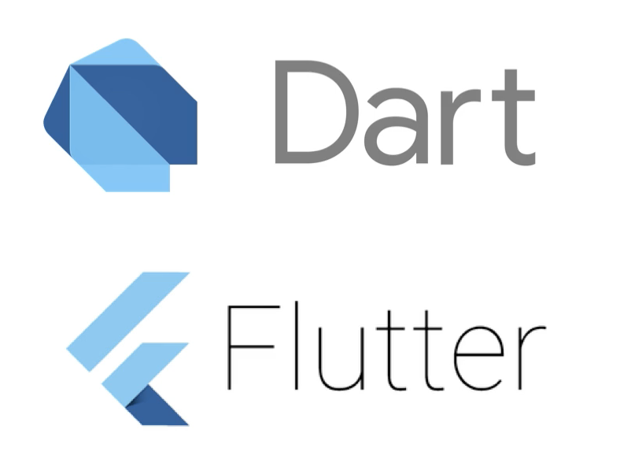

# 1 - Dart 简介

欢迎来学习 `Dart` 编程 - 基础知识。

`Dart` 是 Flutter 的编程语言，Flutter 是来自 Google 的一个跨平台开发框架，已经在移动世界掀起了风暴。借助 Flutter，我们可以使用一个代码库来为 iOS、Android，Web 甚至 Desktop 等构建应用程序。

Dart 于 2011 年由 Google 首次发布，最初旨在替代 JavaScript。其部分目的是为了创建一种类型安全（_type-safe_）的 JavaScript，以用于构建 Web 应用程序，类似于日益流行的 Microsoft 的 JavaScript 的 TypeScript 变体。

我们这里使用的 Dart 版本是 2.4。

Dart 与我们可能熟悉的其它语言（例如: Java、C\#、Swift 和 Kotlin）有许多相似之处:

* 静态类型（Statically-typed） Dart是静态类型的，这意味着类型必须在编译时指定，并且不能在运行时更改。
* 多范式（Multi-Paradigm）

  * 面向对象编程、函数式编程、...

  Dart既促进了面向对象的编程风格，也促进了函数式的编程风格。

* 现代特性（Morden features）

  * 类型推断、字符串表达式、...

  Dart具有现代特性，例如类型推断和在字符串中嵌入表达式，在其他语言中称为字符串插值或字符串模板。

* 可以模仿动态类型（Can mimic dynamic types）

  * **dynamic** 关键字

  尽管它是静态类型的，但Dart也有一个模仿动态类型语言（如JavaScript或Python）的特性，如果您使用过这些语言，它可以帮助您快速入门。

